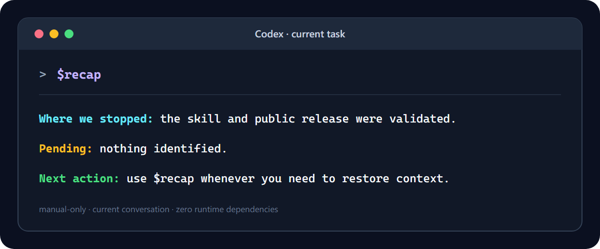

<div align="center">

# Minimal Codex Recap

**A tiny, explicit-only Codex skill inspired by Claude Code's `/recap`, summarizing the current conversation in exactly three lines.**

[](CHANGELOG.md)
[](LICENSE)
[](#security-and-scope)
[](#usage)
[](https://github.com/LightWolfMan/minimal-codex-recap/actions)

[Em português](README.md) · [Installation](#installation) · [How it differs](#how-it-differs) · [Security](#security-and-scope)

</div>



## Inspiration and attribution

Minimal Codex Recap was inspired by the `/recap` experience in
[Claude Code](https://github.com/anthropics/claude-code): the simple, useful
idea of quickly reorienting yourself within a session. This implementation was
written from scratch for Codex, with its own three-line contract, explicit-only
invocation, and the current conversation as its sole source.

This is an independent project. It is **not affiliated with, endorsed by, or
maintained by Anthropic**. The attribution above acknowledges product
inspiration; it does not imply official compatibility or code reuse. A
[public record of the feature is available in the Claude Code repository](https://github.com/anthropics/claude-code/issues/48084).

## Why

Long agent conversations often end with a simple problem: it is hard to see
where the work stopped, what remains, and what should happen next.

`$recap` answers only those three questions. It does not build persistent
memory, inspect the repository, run commands, call tools, or change state. It
uses only context already present in the current Codex conversation.

## Output contract

Every invocation returns exactly three lines in the dominant language of the
conversation. In English:

```text
Where we stopped: ...
Pending: ...
Next action: ...
```

If the conversation does not contain enough evidence, the skill uses honest
fallbacks instead of inventing progress:

```text
Where we stopped: no previous work was identified in this conversation.
Pending: nothing identified.
Next action: wait for a new instruction.
```

In a Portuguese conversation, the skill uses the equivalent Portuguese labels
and fallbacks without mixing languages. If there is not enough context to
identify the language, Brazilian Portuguese is the default.

## Installation

### Skills CLI

```bash
npx skills add LightWolfMan/minimal-codex-recap@recap -g -y
```

Restart Codex or open a new task after installation so the skill list is
reloaded.

### Manual installation on Windows

```powershell
$destination = Join-Path $HOME ".codex\skills\recap"
New-Item -ItemType Directory -Force -Path (Join-Path $destination "agents") | Out-Null
Copy-Item .\skills\recap\SKILL.md (Join-Path $destination "SKILL.md")
Copy-Item .\skills\recap\agents\openai.yaml (Join-Path $destination "agents\openai.yaml")
```

### Manual installation on macOS or Linux

```bash
mkdir -p ~/.codex/skills/recap/agents
cp skills/recap/SKILL.md ~/.codex/skills/recap/SKILL.md
cp skills/recap/agents/openai.yaml ~/.codex/skills/recap/agents/openai.yaml
```

## Usage

Open a new Codex task and type:

```text
$recap
```

The `$` matters. This is a manually invoked skill, not a `/recap` slash
command. `policy.allow_implicit_invocation` is explicitly set to `false`.

The language is selected from the user's latest substantive messages: English
for English conversations and Portuguese for Portuguese conversations.

The global Codex skills directory is shared by Codex App and Codex CLI, so the
same installation works in both surfaces.

## Security and scope

| Property | Behavior |
|---|---|
| Invocation | Manual only through `$recap` |
| Input source | Current conversation only |
| Output language | English or Portuguese, matching the conversation |
| File access | Forbidden by the skill |
| Tool calls | Forbidden by the skill |
| Persistent memory | Not used |
| Network access | Not requested |
| State changes | Forbidden by the skill |
| Runtime dependencies | None |
| Bundled executable code | None |

This is an instruction-only skill. As with any LLM instruction, the repository
documents and tests the intended contract; enforcement ultimately depends on
the Codex runtime following the loaded skill.

## How it differs

There are excellent projects with overlapping names, but different jobs:

| Project | Primary purpose | Persistent state | Tools or scripts | Typical output |
|---|---|---:|---:|---|
| **Minimal Codex Recap** | Snapshot of the current conversation | No | No | Exactly three lines |
| [AgentMemory Recap](https://github.com/rohitg00/agentmemory/blob/main/plugin/skills/recap/SKILL.md) | Summarize multiple stored agent sessions | Yes | Yes | Sessions grouped by date |
| [BuilderIO Quick Recap](https://github.com/BuilderIO/skills/tree/main/skills/quick-recap) | Add a green/yellow/red status footer | No | Installer-managed instructions | One status line |
| [Session Handoff](https://github.com/softaworks/agent-toolkit/tree/main/skills/session-handoff) | Save and resume detailed cross-session state | Yes | Yes | Handoff documents |

This project is not affiliated with those projects. They are linked as useful
prior art and alternatives for users who need broader workflows.

## Validation

Version 1.1.0 makes the output follow the conversation language without
changing the security boundaries or the three-line contract. The skill was
validated with:

- the official Codex `quick_validate.py`;
- known-context scenarios in English and Portuguese;
- insufficient-context scenarios in English and Portuguese;
- a fresh global Codex CLI smoke test in a read-only sandbox;
- event inspection confirming no tool item was emitted during recap turns.

Run the repository's dependency-free contract checks:

```bash
python tests/validate_skill.py
```

CI runs the same validation on Windows and Ubuntu.

## Integrity

Approved SHA-256 hashes for v1.1.0:

| File | SHA-256 |
|---|---|
| `skills/recap/SKILL.md` | `3EEB98C2DED080701B4C6440641258F358745DDB65B89FF6823C3BC80073A604` |
| `skills/recap/agents/openai.yaml` | `43493E9963711B7F4342B6A6AB50B4F2922CE35C78CB2E9C40B7CB73FA18E756` |

## License

[MIT](LICENSE) © 2026 LightWolfMan.
