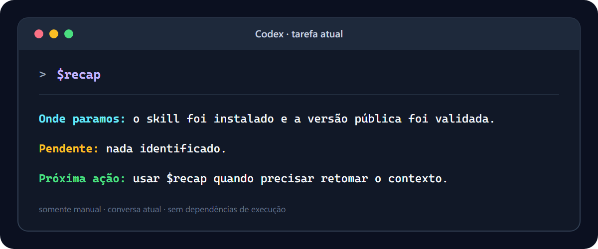

<div align="center">

# Minimal Codex Recap

**Um skill minúsculo e exclusivamente manual que resume a conversa atual do Codex em exatamente três linhas.**

[](CHANGELOG.md)
[](LICENSE)
[](#segurança-e-escopo)
[](#uso)

[English](README.md) · [Instalação](#instalação) · [Diferenças](#como-ele-se-diferencia) · [Segurança](#segurança-e-escopo)

</div>



## Por quê?

Depois de uma conversa longa com um agente, três informações costumam ficar
espalhadas: onde o trabalho parou, o que ainda falta e o que deve acontecer em
seguida.

`$recap` responde somente essas três perguntas. Ele não cria memória
persistente, não inspeciona o projeto, não executa comandos, não chama
ferramentas e não altera estado. A única fonte é o contexto já presente na
conversa atual do Codex.

## Contrato de saída

Toda invocação retorna exatamente:

```text
Onde paramos: ...
Pendente: ...
Próxima ação: ...
```

Se não houver evidência suficiente na conversa, o skill usa fallbacks honestos
em vez de inventar progresso:

```text
Onde paramos: nenhum trabalho anterior foi identificado nesta conversa.
Pendente: nada identificado.
Próxima ação: aguardar nova instrução.
```

## Instalação

### Skills CLI

```bash
npx skills add LightWolfMan/minimal-codex-recap@recap -g -y
```

Depois da instalação, reinicie o Codex ou abra uma task nova para recarregar a
lista de skills.

### Instalação manual no Windows

```powershell
$destination = Join-Path $HOME ".codex\skills\recap"
New-Item -ItemType Directory -Force -Path (Join-Path $destination "agents") | Out-Null
Copy-Item .\skills\recap\SKILL.md (Join-Path $destination "SKILL.md")
Copy-Item .\skills\recap\agents\openai.yaml (Join-Path $destination "agents\openai.yaml")
```

### Instalação manual no macOS ou Linux

```bash
mkdir -p ~/.codex/skills/recap/agents
cp skills/recap/SKILL.md ~/.codex/skills/recap/SKILL.md
cp skills/recap/agents/openai.yaml ~/.codex/skills/recap/agents/openai.yaml
```

## Uso

Abra uma task nova do Codex e digite:

```text
$recap
```

O `$` é importante. Este é um skill invocado manualmente, não um comando
`/recap`. A configuração `policy.allow_implicit_invocation` está explicitamente
definida como `false`.

O diretório global de skills é compartilhado pelo Codex App e pelo Codex CLI,
portanto a mesma instalação funciona nas duas superfícies.

## Segurança e escopo

| Propriedade | Comportamento |
|---|---|
| Ativação | Exclusivamente manual por `$recap` |
| Fonte | Somente a conversa atual |
| Leitura de arquivos | Proibida pelo skill |
| Ferramentas | Proibidas pelo skill |
| Memória persistente | Não utilizada |
| Rede | Não solicitada |
| Alterações de estado | Proibidas pelo skill |
| Dependências de execução | Nenhuma |
| Código executável incluído | Nenhum |

Este é um skill composto apenas por instruções. Como ocorre com qualquer
instrução para um LLM, o repositório documenta e testa o contrato pretendido; a
execução final depende de o runtime do Codex seguir o skill carregado.

## Como ele se diferencia

Existem projetos excelentes com nomes próximos, mas objetivos diferentes:

| Projeto | Objetivo principal | Estado persistente | Ferramentas ou scripts | Saída típica |
|---|---|---:|---:|---|
| **Minimal Codex Recap** | Retrato da conversa atual | Não | Não | Exatamente três linhas |
| [AgentMemory Recap](https://github.com/rohitg00/agentmemory/blob/main/plugin/skills/recap/SKILL.md) | Resumir várias sessões armazenadas | Sim | Sim | Sessões agrupadas por data |
| [BuilderIO Quick Recap](https://github.com/BuilderIO/skills/tree/main/skills/quick-recap) | Adicionar rodapé verde/amarelo/vermelho | Não | Instruções gerenciadas pelo instalador | Uma linha de status |
| [Session Handoff](https://github.com/softaworks/agent-toolkit/tree/main/skills/session-handoff) | Salvar e retomar contexto entre sessões | Sim | Sim | Documentos de handoff |

Este projeto não é afiliado a esses projetos. Eles aparecem como referências e
alternativas úteis para quem precisa de fluxos mais abrangentes.

## Validação

A versão 1.0.1 foi validada com:

- o `quick_validate.py` oficial do Codex;
- cenário com trabalho concluído, pendência e próxima ação conhecidas;
- cenário sem contexto suficiente, exigindo os fallbacks literais;
- smoke test global em processo novo do Codex CLI e sandbox somente leitura;
- inspeção de eventos confirmando ausência de ferramentas nos turnos de recap.

Execute os testes de contrato do repositório, sem dependências externas:

```bash
python tests/validate_skill.py
```

A integração contínua repete o teste no Windows e no Ubuntu.

## Integridade

Hashes SHA-256 aprovados para a versão 1.0.1:

| Arquivo | SHA-256 |
|---|---|
| `skills/recap/SKILL.md` | `F4CE8B4B0B7DB1516A5C397FD3BAB904DC03C6DDF17CA3A4BF2222CA3D0E8467` |
| `skills/recap/agents/openai.yaml` | `1A2DB46B36959BB31CC0F4046A59CC4CBFB77DB53030C0542D91B04ED9D188D8` |

## Licença

[MIT](LICENSE) © 2026 LightWolfMan.
